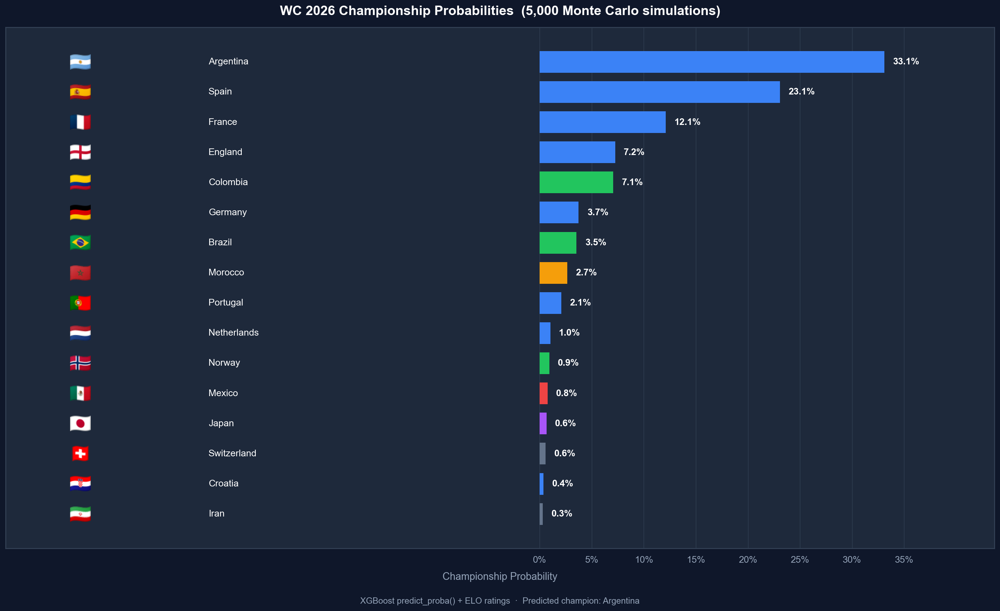

# WC 2026 Prediction System

A FIFA World Cup 2026 prediction pipeline and analytics dashboard built on 49,459 historical international football matches (1872–2026).

## Live Dashboard

> **[→ Open Dashboard](http://localhost:3000)** (run locally — see [Quick Start](#quick-start))



---

## What's Inside

| Component | Description |
|---|---|
| `results.csv` / `goalscorers.csv` / `shootouts.csv` | Core dataset — international match results from 1872 to 2026 |
| `Data_Inspect.ipynb` | EDA notebook — trends, top scorers, goal distributions |
| `Predictions.ipynb` | Prediction pipeline — ELO ratings, XGBoost model, Monte Carlo bracket simulation |
| `dashboard/` | Node.js + Express analytics dashboard (5 pages, Chart.js) |
| `data/worldcup2026_clean.csv` | WC2026 fixtures (60 played + 12 remaining group matches) |
| `wc2026_*.png` | Output figures — group stage board, full bracket, champion probabilities |

---

## Prediction Pipeline

### 1 — Feature Engineering
- **ELO ratings** computed per-match on 49,459 historical results (K-factors: WC=60, UEFA/CONMEBOL/CAF=40, Friendly=20; home bonus +100 ELO)
- **Rolling form** — win rate, goals scored/conceded over last 10 matches per team
- **Match context** — tournament category, neutral venue flag, month, year
- **13 features total**, all derived without data leakage (temporal sort applied first)

### 2 — Model
- **XGBoost** 3-class classifier (home\_win / draw / away\_win)
- Trained on 1900–2021, validated on 2022–2023
- Validation accuracy: **59.7%** vs 50% naive baseline

### 3 — Monte Carlo Bracket Simulation
- 5,000 full-bracket simulations from Round of 32 to Final
- At each knockout match, outcome is sampled from `predict_proba()` weights

### Predicted Champion: Argentina (33.1%)

| Rank | Team | Probability |
|---|---|---|
| 1 | Argentina | 33.1% |
| 2 | Spain | 23.1% |
| 3 | France | 12.1% |
| 4 | England | 7.2% |
| 5 | Colombia | 7.1% |

---

## Dashboard Pages

| Page | Content |
|---|---|
| **Dashboard** | KPIs, group goals heatmap, result distribution donut, top-scorer leaderboard |
| **Explorer** | Historical win-rate trends, goals-per-decade chart, ELO distribution |
| **Predictions** | All 12 remaining group matches with H% / D% / A% breakdown |
| **ELO Rankings** | Top 20 current ELO ratings with change indicators |
| **WC 2026** | Live standings for all 12 groups, knockout bracket, champion probabilities |

---

## Quick Start

### Run the Dashboard

```bash
cd dashboard
npm install
npm start
# open http://localhost:3000
```

**Requirements:** Node.js ≥ 18

### Run the Prediction Notebook

```bash
# Install dependencies
pip install pandas numpy matplotlib scikit-learn xgboost pillow requests

# Execute notebook
jupyter nbconvert --to notebook --execute --inplace Predictions.ipynb

# Or open interactively
jupyter notebook Predictions.ipynb
```

**Requirements:** Python ≥ 3.10

---

## Project Structure

```
international_results-master/
├── results.csv                   # 49,459 international match results
├── goalscorers.csv               # Goal-level data (scorer, minute, type)
├── shootouts.csv                 # Penalty shootout results
├── former_names.csv              # Country name history
├── data/
│   ├── worldcup2026_clean.csv    # WC2026 fixture list
│   └── worldcup2026_matches_enriched.csv
├── Data_Inspect.ipynb            # Exploratory data analysis
├── Predictions.ipynb             # Prediction model + bracket simulation
├── predictions.md                # Full prediction results & methodology
├── wc2026_group_stage.png        # Group stage board figure
├── wc2026_bracket.png            # Knockout bracket figure
├── wc2026_champion_probs.png     # Champion probability chart
├── api_call.py                   # Script to refresh live WC2026 fixture data
└── dashboard/
    ├── server.js                 # Express static server
    ├── package.json
    ├── Procfile                  # Heroku / Railway deploy
    └── public/
        ├── index.html
        ├── style.css
        └── app.js
```

---

## Dataset

The underlying dataset is maintained by [martj42](https://github.com/martj42/international_results). It covers all international men's football matches from 1872 to the present, with team names standardised to current names for consistency.

CSV files are relational and can be joined on `date + home_team + away_team`.

---

## Deploy the Dashboard

The dashboard is a plain Node.js + Express static server — it can be deployed to any Node-compatible platform in seconds.

### Railway / Render

1. Push the repo to GitHub
2. Create a new project from the `dashboard/` directory
3. Set the start command to `npm start`
4. PORT is read from `process.env.PORT` automatically

### Heroku

```bash
cd dashboard
heroku create wc2026-dashboard
git subtree push --prefix dashboard heroku main
```

### Docker

```dockerfile
FROM node:20-alpine
WORKDIR /app
COPY dashboard/package*.json ./
RUN npm ci --production
COPY dashboard/ .
EXPOSE 3000
CMD ["node", "server.js"]
```

---

## Tech Stack

| Layer | Tech |
|---|---|
| Data | Pandas, XGBoost, Scikit-learn, Matplotlib |
| Server | Node.js 20 + Express 4 |
| Frontend | Vanilla JS + Chart.js 4 |
| Typography | Inter (Google Fonts) |
| Deployment | Railway / Render / Heroku |

---

## License

Dataset: see original repository by [martj42](https://github.com/martj42/international_results).  
Dashboard & prediction code: MIT.
